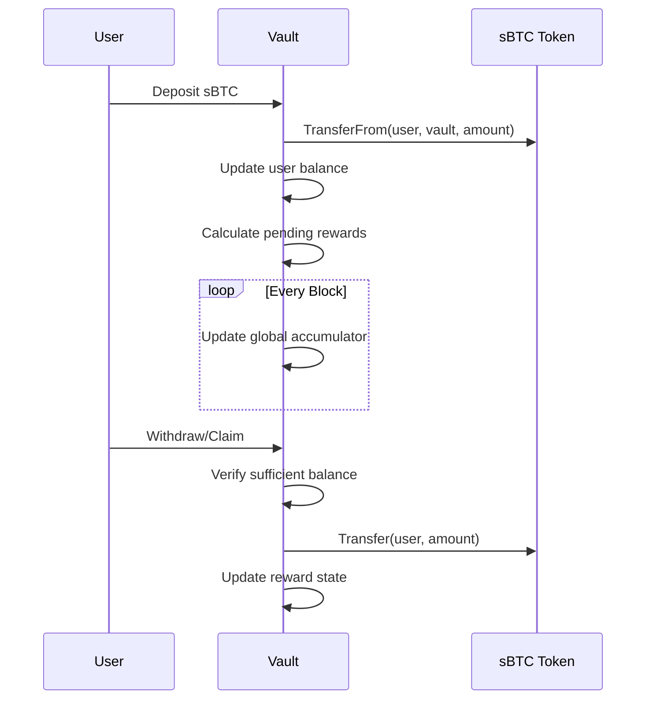

# sBTC Yield Vault

A non-custodial yield generation protocol for sBTC holders on the Stacks blockchain.

## Overview

The sBTC Yield Vault is a decentralized finance protocol that enables holders of sBTC (wrapped Bitcoin on Stacks) to earn compound yields through automated strategies. The vault is designed to be secure, transparent, and user-controlled, allowing depositors to generate returns on their Bitcoin while maintaining custody of their assets.

## Features

- **Non-custodial architecture**: Users maintain full control of their assets
- **Automated yield accrual**: Rewards calculated per block based on deposit amount
- **Dynamic APY**: Adjustable yield rates by authorized administrators
- **Transparent reward calculation**: Clear formula for determining user rewards
- **Principal protection**: Secure deposit and withdrawal mechanics
- **Governance-minimized design**: Limited administrative controls with time-locks
- **Emergency withdrawal system**: Safety mechanism for unexpected events

## Architecture

The sBTC Yield Vault is implemented as a Clarity smart contract with the following components:

### Core Components

```text
┌─────────────────────────────────────────────────────────┐
│                   sBTC Yield Vault                      │
├─────────────────┬───────────────────┬──────────────────┤
│  User Interface │   Core Protocol   │  Admin Controls  │
├─────────────────┼───────────────────┼──────────────────┤
│ - Deposit       │ - Yield Accrual   │ - Rate Setting   │
│ - Withdraw      │ - Token Custody   │ - Emergency Mode │
│ - Claim Rewards │ - State Tracking  │ - Timelocks      │
└─────────────────┴───────────────────┴──────────────────┘
```

### 1. State Management

The contract maintains several data structures to track user deposits, rewards, and global state:

- **User Deposits**: Maps user principals to their deposited amounts
- **Last Deposit Block**: Tracks when users last interacted with the vault
- **User Rewards**: Accumulates earned but unclaimed rewards
- **Global Accumulator**: Tracks system-wide yield calculations
- **Contract Parameters**: Yield rate, admin controls, and protocol limits

### 2. Yield Generation Mechanism

The yield mechanism uses a time-based accrual model:

1. Yield rate is defined in basis points (e.g., 50 = 0.5%)
2. Rewards accrue based on blocks elapsed since last deposit/interaction
3. Calculation formula: `rewards = deposit_amount * yield_rate * blocks_elapsed / yield_period`

### 3. Security Model

The contract implements several security patterns:

- **Checks-Effects-Interactions**: State changes before external calls
- **Fail-safe Mechanisms**: Revert state on transfer failures
- **Administrative Timelocks**: Delayed execution of parameter changes
- **Emergency Mode**: Allows users to withdraw funds in case of protocol issues
- **Deposit Limits**: Prevents excessive concentration of funds

## Technical Flow

### Deposit Flow

```text
User ──(sBTC)──> Vault Contract ──> Update User State
                                      │
                                      ▼
                                 Calculate Rewards
                                      │
                                      ▼
                                 Issue Event Log
```

### Reward Calculation Flow

```text
Calculate Pending Rewards
        │
        ▼
  Check Eligibility
        │
        ▼
   Apply Yield Rate
        │
        ▼
 Scale by Time Factor
```

### Withdrawal Flow

```text
User Request ──> Validate Balance ──> Update State
                                         │
                                         ▼
                                    Transfer sBTC
                                         │
                                         ▼
                               Revert State on Failure
```

## Workflow Diagram



## Function Reference

### User Functions

- **`deposit(amount)`**: Deposit sBTC into the vault
- **`withdraw(amount)`**: Withdraw sBTC from the vault
- **`claim-rewards()`**: Claim accumulated yield rewards
- **`emergency-withdraw()`**: Withdraw all funds during emergency mode

### Admin Functions

- **`set-yield-rate(new-rate)`**: Update the current yield rate
- **`schedule-yield-rate-change(new-rate)`**: Schedule a future yield rate change
- **`execute-yield-rate-change(new-rate)`**: Execute a previously scheduled rate change
- **`set-admin(new-admin)`**: Transfer administrative control
- **`fund-vault(amount)`**: Add sBTC to the vault's reward pool
- **`update-token-contract(new-address)`**: Update the sBTC token contract address
- **`enable-emergency-mode()`**: Activate emergency withdrawal mechanism

### View Functions

- **`get-user-deposit(user)`**: Get the total amount deposited by a user
- **`get-user-rewards(user)`**: Get the accumulated rewards for a user
- **`get-yield-rate()`**: Get the current yield rate in basis points
- **`calculate-pending-rewards(user)`**: Calculate pending rewards for a user
- **`get-vault-balance()`**: Get the total sBTC balance in the vault

## Error Codes

| Code | Description |
|------|-------------|
| `ERR_NOT_OWNER` | Action requires ownership |
| `ERR_INSUFFICIENT_BALANCE` | User has insufficient balance |
| `ERR_INSUFFICIENT_VAULT_FUNDS` | Vault has insufficient funds |
| `ERR_UNAUTHORIZED` | Action requires authorization |
| `ERR_DEPOSIT_FAILED` | Token transfer into vault failed |
| `ERR_WITHDRAW_FAILED` | Token transfer out of vault failed |
| `ERR_DEPOSIT_LIMIT_REACHED` | User deposit exceeds current limits |
| `ERR_INVALID_YIELD_RATE` | Yield rate outside acceptable range |
| `ERR_INVALID_TOKEN_CONTRACT` | Invalid token contract address |
| `ERR_INVALID_DEPOSIT_LIMIT` | Deposit limit outside acceptable range |

## Integration

The vault is designed to work with the official sBTC token contract on Stacks testnet:
`ST1F7QA2MDF17S807EPA36TSS8AMEFY4KA9TVGWXT.sbtc-token`

## Security Considerations

1. **Yield Sustainability**: Ensure the vault has sufficient funds to pay rewards
2. **Smart Contract Risk**: Review and audit the contract before significant deposits
3. **Parameter Changes**: Monitor timelock periods for administrative actions
4. **Emergency Mode**: Understand the conditions that could trigger emergency mode

## Development Setup

1. Clone the repository
2. Set up a local Stacks development environment
3. Deploy the contract to testnet
4. Interact with the contract using Clarity CLI or frontend applications

## Future Enhancements

1. **Multi-asset support**: Enable deposits of multiple types of assets
2. **Stratified yield rates**: Different rates based on deposit amount or lock period
3. **Governance token**: Community governance of protocol parameters
4. **Automated yield strategies**: Integration with DeFi protocols for yield generation
